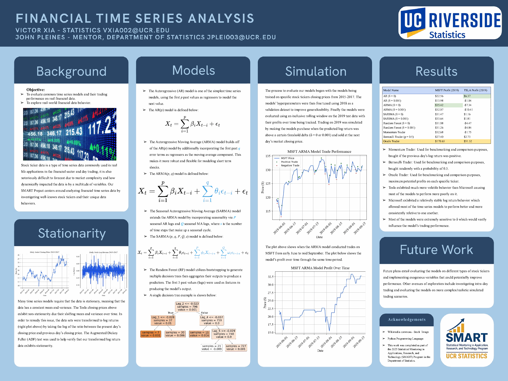
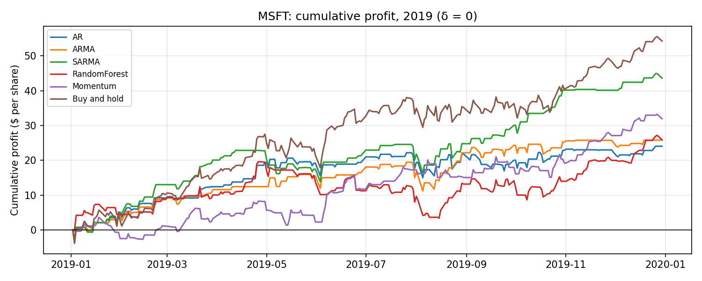
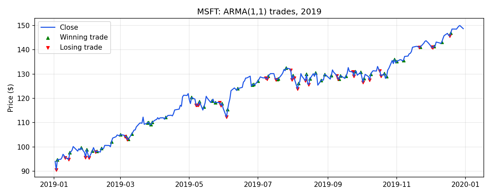

# Financial Time Series Analysis: Forecasting and Trading Stock Returns

Can classical time series models and a random forest predict next-day stock returns well enough to trade on? This project fits AR, ARMA, seasonal ARMA, and random forest models to daily Microsoft (MSFT) and Tesla (TSLA) returns, tunes them on a held-out validation year, and backtests a simple trading rule on 2019 against momentum, random, buy-and-hold, and perfect-foresight benchmarks.

Research conducted by **Victor Xia** with mentor John Pleines (PhD candidate) through the UC Riverside Statistics Department's **SMART program** (Statistical Mentoring in Applications, Research, and Technology), Spring 2025.

🏆 **FN David Rising Scholar Award**, Florence Nightingale David Symposium, and **SMART Mentee Award**

[](docs/poster.pdf)
*Research poster (click for the full PDF)*

## Approach

1. **Data.** Daily closing prices for 2015–2019 from Yahoo Finance.
2. **Stationarity.** Prices trend and change volatility over time, so every model works on daily log returns, log(P<sub>t</sub> / P<sub>t−1</sub>), which the Augmented Dickey–Fuller test supports as stationary.
3. **Time-ordered split.** Train on 2015–2017, select hyperparameters on 2018, and hold out 2019 for the final test. Nothing is shuffled.
4. **Model selection.** Candidate orders came from ACF/PACF plots and AIC on the training years, and the final choice was the lowest walk-forward MSE on 2018:
   - AR(1)
   - ARMA(1,1)
   - Seasonal ARMA(1,1)×(1,1)<sub>62</sub>
   - Random forest on the previous 5 daily returns, 100 trees
5. **Walk-forward evaluation.** For each day in 2019, every model is refit on all data before that day and predicts that day's return, so no future information leaks into a forecast.
6. **Trading rule.** Buy at the previous close when the predicted return is above a threshold δ (0 or 0.001), and sell at the next close. Profit is in dollars per share, with no transaction costs.

## Results (2019 test year)

| Strategy | MSFT profit ($/share) | TSLA profit ($/share) |
|---|---:|---:|
| AR (δ = 0) | 24.05 | 6.85 |
| AR (δ = 0.001) | 16.02 | −1.45 |
| ARMA (δ = 0) | 25.80 | **8.26** |
| ARMA (δ = 0.001) | 23.30 | 0.57 |
| SARMA (δ = 0) | **43.61** | 2.36 |
| SARMA (δ = 0.001) | 26.41 | −3.73 |
| Random forest (δ = 0) | 25.89 | −1.08 |
| Random forest (δ = 0.001) | 8.20 | −2.12 |
| *Momentum (buy after an up day)* | 31.94 | −1.75 |
| *Random (p = 0.5)* | 9.81 | 3.15 |
| *Buy and hold* | *54.25* | *5.46* |
| *Oracle (perfect foresight)* | 168.96 | 51.32 |

Generated by `scripts/run_backtest.py`. Trade counts, win rates, and forecast MSE for every strategy are in [`results/backtest_summary.csv`](results/backtest_summary.csv).




**Takeaways**

- **None of the models beat buy-and-hold on MSFT.** Every model was profitable, and SARMA did best at $43.61, but simply holding the stock earned $54.25. In a strongly rising year, the models sat out too many up days.
- **On the more volatile TSLA, ARMA ($8.26) and AR ($6.85) edged out buy-and-hold ($5.46).** The random forest and momentum rules lost money.
- **The threshold δ changed results more than the choice of model.** Raising δ from 0 to 0.001 made trades rarer and more accurate. For example, MSFT ARMA went from 91 trades with a 62% win rate to 18 trades with a 78% win rate. But total profit fell for almost every model.
- **The profits are fragile.** The predicted returns sit very close to zero, so tiny differences in model fitting flip buy/no-buy decisions. Compared with the numbers on the original poster, these reruns have nearly identical forecast errors, yet some model rankings changed. For example, TSLA ARMA went from −$7.34 to +$8.26. Differences like these shouldn't be read as evidence of real predictive skill.
- **All strategies capture only a small fraction of the oracle's profit, and this backtest ignores transaction costs.** Next-day returns are close to unpredictable, which is consistent with the efficient-market view.

## Repository layout

```
├── src/forecasting/
│   ├── config.py      # date splits, chosen model orders, thresholds
│   ├── data.py        # download + cache prices, split by date, log returns, lag features
│   ├── models.py      # walk-forward AR / ARMA / SARMA / random forest forecasts
│   ├── backtest.py    # trading rule, benchmarks, profit summaries
│   └── plots.py       # figures
├── scripts/
│   ├── select_models.py   # ACF/PACF, AIC, and validation MSE on 2018
│   └── run_backtest.py    # 2019 backtest → results/ tables and figures
├── results/               # generated tables and figures
└── docs/poster.pdf
```

## Running it

Requires Python 3.10+.

```bash
pip install -r requirements.txt
python scripts/run_backtest.py                 # MSFT and TSLA; the first run is slow (daily SARMA refits)
python scripts/run_backtest.py --tickers AAPL  # any other ticker
python scripts/select_models.py --skip-sarma   # reproduce model selection
```

Prices are cached in `data/` after the first download, and model predictions in `results/predictions/`, so later runs only repeat the trading simulation.

## Future work

- Evaluate the models on other asset types and market regimes.
- Add exogenous features such as the VIX volatility index.
- Model intraday data.
- Make the simulation more realistic with transaction costs, position sizing, and risk-adjusted metrics such as the Sharpe ratio.

## Acknowledgments

Thank you to my mentor John Pleines and the UC Riverside Department of Statistics for selecting me for the SMART program and for my first experience in academic research.
